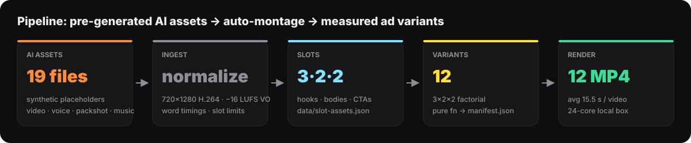
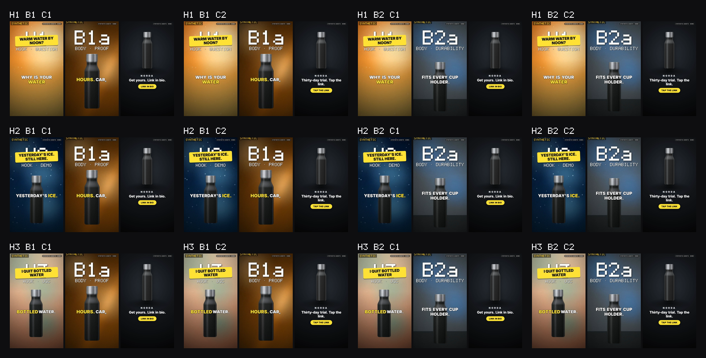
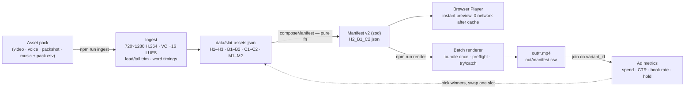
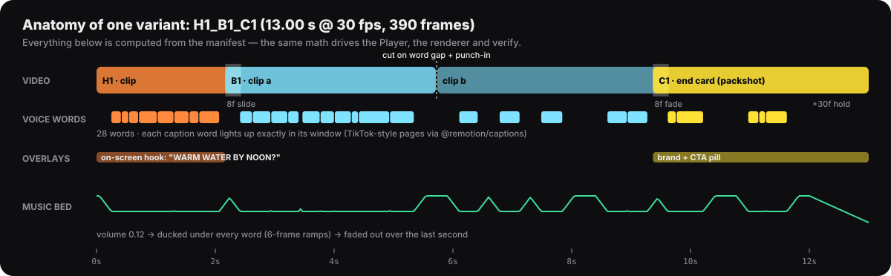
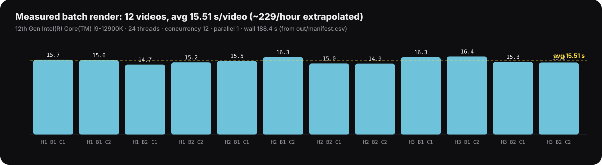

# NORDA Ad Engine · Remotion auto-montage

**Pre-generated AI assets in → 12 ad variants out → batch-rendered MP4s with measured metrics.**
A working prototype for the *Video Editor (Remotion)* role: one data-driven Remotion template that turns
scripts, UGC/AI footage, voice-overs and music into many short ads, and a batch pipeline that measures itself.

**[▶ Live Playground](https://ryze-video-engine.vercel.app)** · [12 rendered previews](public/previews) · [render metrics (CSV)](public/manifest.csv) · [ingest report](docs/INGEST_REPORT.md)




<sub>Frames grabbed from the 12 rendered MP4s (`npm run previews`). Each triptych = hook · body · end card of one variant. Rows = hooks, columns = body × CTA.</sub>

## What the role asks → what is here

| The role says | Implemented | Proof |
|---|---|---|
| Remotion templates for UGC edits, AI formats, ad variations | One slot template `AdVariant` (hook → body → CTA), 2 caption styles, 3 formats (9:16, 4:5, 1:1) | [`src/remotion/AdVariant.tsx`](src/remotion/AdVariant.tsx), Playground |
| Automate captions | Word-timed TikTok-style pages (`@remotion/captions`), one active word, safe zone y 55–68 % | [timeline](docs/img/timeline.svg) |
| …hooks | On-screen hook text over the first ≤ 3 s + 3 interchangeable hook slots | [matrix](docs/img/matrix.svg) |
| …music | Music bed ducked under every spoken word (6-frame ramps), 1 s fade-out | [timeline](docs/img/timeline.svg) |
| …transitions | `@remotion/transitions` slide/fade; body cut on the word gap nearest 50 % with a punch-in | [filmstrip](docs/img/filmstrip.png) |
| …batch rendering | Bundle once, render loop, per-variant preflight, failures isolated, CSV after every video | `npm run render`, [render-times](docs/img/render-times.svg) |
| Ship 100+ finished videos a day | **12 videos rendered in 188 s wall** (measured) → ~229/hour extrapolated on one 24-thread desktop CPU | [`public/metrics.json`](public/metrics.json) |
| Iterate templates on metrics, not looks | Variant id encodes the factors; CSV has `spend, ctr, hook_rate_3s, hold_rate` columns to join ad exports; full-factorial grid | [Iterate on metrics](#iterate-on-metrics-not-looks) |

## How it works



**One contract** ([`src/contract.ts`](src/contract.ts), zod 4) is shared by ingest, Player, renderer and the verify gate.
A video is a pure function of its manifest: duration, size and timing all come from data
([`src/lib/timing.ts`](src/lib/timing.ts)), never from hard-coded frames.



## Measured



| | |
|---|---|
| Output | 12 × MP4, 1080×1920, H.264 + AAC, 30 fps, 12.3–14.1 s each (manifest + ffprobe) |
| Batch | 12/12 rendered, 0 skipped, 0 failed · 188.4 s wall + 2.7 s bundle |
| Speed | avg **15.5 s per video** (min 14.7, max 16.4) · ~229 videos/hour extrapolated from this batch |
| Machine | Intel Core i9-12900K (16 cores / 24 threads), 64 GB, Windows 11, Node 24 · concurrency 12, 1 video at a time |
| Throughput knob | same 12 with `--parallel 3 --concurrency 8`: 121.2 s wall → ~356/hour extrapolated (each video slower, 29.2 s, but 3 at once). One run, same box: [`public/metrics-p3c8.json`](public/metrics-p3c8.json) |
| Failure isolation | batch with 1 corrupt manifest + 1 deleted asset → 2 rendered, 2 skipped with reasons, exit 0: [`docs/evidence/failure-isolation.csv`](docs/evidence/failure-isolation.csv) (`--strict` makes any skip exit 1) |
| Gate | `npm run verify` → `ALL PASSED (148 checks)` |

Numbers come from [`out/manifest.csv`](public/manifest.csv) / [`public/metrics.json`](public/metrics.json) of the run committed here.
They are one machine, synthetic placeholder media, one configuration; videos/hour is extrapolated from a 12-video batch.
`rss_mb` is the peak RSS of the Node orchestrator only (Chrome and ffmpeg excluded). Re-measure on yours with `npm run render`.

## Run it

```bash
npm install
npm run make:pack                          # synthetic pack -> inbox/synthetic-pack (offline, deterministic)
npm run ingest -- inbox/synthetic-pack     # or: npm run ingest -- inbox/ryze-asset-pack.zip
npm run build:variants                     # 3 x 2 x 2 = 12 manifests -> data/variants/
npm run render                             # 12 MP4 -> out/ + out/manifest.csv + public/metrics.json
npm run previews                           # 540p web previews + contact sheet
npm run dev                                # Playground at http://localhost:3000
npm run verify                             # tsc + 148 checks
```

No API keys, no network at render (fonts and media are local). The first render downloads Chrome Headless Shell;
if that host is blocked, pass `--browser <chrome.exe>` or set `REMOTION_BROWSER_EXECUTABLE`.
Useful flags: `render -- --only H2 --limit 4 --concurrency 8 --parallel 2`, `build:variants -- --style clean --music M2 --format 4x5`.

## Bring your own assets

The engine is built against a pack contract, not against specific files. Drop a folder or zip into `inbox/` and ingest it:

```
ryze-asset-pack/
├─ pack.csv                     file, slot, kind, tool, model, prompt, text, onScreen, created
├─ brand/packshot.png           product on transparent background (end card hero)
├─ hooks/   H1-3.mp4 + H1-3.mp3 (+ optional H1.words.json / H1.srt)
├─ bodies/  B1a, B1b, B2a, B2b.mp4 + B1, B2.mp3   (2 clips per body; the cut is automatic)
├─ ctas/    C1, C2.mp3 (+ optional C.mp4)
└─ music/   M1, M2.mp3          sfx/ whoosh.wav, pop.wav (optional)
```

Ingest validates the tree against `pack.csv`, probes every file, rejects non-9:16 video / packshot without alpha /
voice without audio, normalizes video (720×1280, ≤ 3 MB) and voice (0.25 s lead, 0.35 s tail, −16 LUFS),
derives word timings (`words.json` → `.srt` → silence detection) and enforces slot limits (hook ≤ 4 s, body ≤ 9 s, CTA ≤ 3.5 s, music ≥ 18 s).
Source clips ≥ 1080×1920 also get a 1080p mezzanine (crf 18, `media-cache/`, not committed): the renderer uses it, the browser uses the 720p proxy.
Every file gets OK/FAIL with a reason in [`docs/INGEST_REPORT.md`](docs/INGEST_REPORT.md). Full spec: [`docs/ASSET_PACK.md`](docs/ASSET_PACK.md).

## Iterate on metrics, not looks

* **Variant id = experiment design.** `H2_B1_C2` is hook 2 × body 1 × CTA 2; non-default axes append (`_clean_m2_f45`).
* **Full factorial, one variable family per test.** The 12 core variants hold style, music and format constant, so
  differences in hook rate or CTR can be attributed to hook / body / CTA main effects (each hook appears in 4 cells).
* **The CSV is the join key.** `out/manifest.csv` ships empty `spend, ctr, hook_rate_3s, hold_rate` columns.
  Paste the Meta/TikTok export on `variant_id`, keep the winning hook, swap one slot, re-run `build:variants`.
* **Scale is rows, not code.** verify simulates 5 hooks × 4 bodies × 5 CTAs = 100 valid variants from the same functions.

## Honest scope

* **Assets:** the committed pack is **synthetic** (procedural clips with the slot id drawn in, offline Windows SAPI voice,
  procedural music), labeled `SYNTHETIC` in every frame and in the UI. A pack of real pre-generated AI assets
  (Kling/Higgsfield video, ElevenLabs voice, Suno music) goes through the same `ingest` with no code change.
  The demo automates the **montage**; generation happens before it, offline.
* **Word timings:** the synthetic voice ships TTS word-start events (word ends estimated from audio energy). The silence-detection fallback is exact on
  separated words (1 ms error in verify) but only an estimate on fluent speech; real packs should include `words.json`/`.srt`.
* **Rendering is local.** Vercel hosts the static Playground (browser Player). Server-side MP4 rendering in serverless
  functions is a poor fit (time/memory). The production path would be `@remotion/lambda` with the same manifests as
  `inputProps`; it is **not** implemented here.
* **Licenses of a real pack:** tool, model and date per file come from `pack.csv` and show in the Playground. Free tiers of
  ElevenLabs and Suno are, to my knowledge, non-commercial; this is a non-commercial demo, check your plan before reuse.
* NORDA is a fictional brand; all copy is demo copy. Remotion is free for individuals and companies up to 3 people;
  larger companies need a [Remotion Company License](https://www.remotion.dev/license). This repo's code is MIT.

## Repo map

| Path | Role |
|---|---|
| `src/contract.ts` | zod manifest v2 + slot-assets schema + engine constants |
| `src/lib/variants.ts` · `timing.ts` | pure, client-safe: compose / enumerate variants, frame math, ducking |
| `src/lib/preflight.ts` | node-only: file exists, audio fits slot; never throws |
| `src/lib/media/**` | node-only: bundled ffmpeg/ffprobe, VAD, loudness, PNG/WAV, synthetic generators |
| `src/remotion/**` | `AdVariant` composition, captions, hook overlay, end card, theme, safe zones |
| `app/**` · `src/components/**` | Next.js Playground (static, no API routes) |
| `scripts/*` | make:pack · ingest · build:variants · render · previews · qa:stills · ui:shots · docs:figures · verify |
